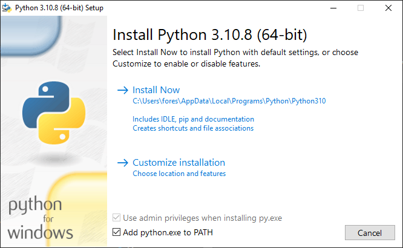

 

  

<h1 align="center">External Melee Camera</h1>

# Description
**EMC** is a Blender script that enables you to control various functions
in Super Smash Bros. Melee and Dolphin directly from Blender. 

It mainly focuses on camera controls, but it also allows you to
load states, toggle play/pause, and generate image sequences.

Consider supporting me on Ko-fi, this project took a lot of time
and effort and I would appreciate the tips!

## Getting Started
>### Requirements
> * Windows 10
> * [Python 3.10.8](https://www.python.org/downloads/release/python-3108/)
> * [Pymem](https://pymem.readthedocs.io/en/latest/)
> * [Blender 3.3 LTS Portable](https://www.blender.org/download/lts/3-3/)
> * [Slippi Launcher 2.7+](https://slippi.gg/)

[!NOTE]
It is important to install the version of Python that comes packaged with Blender.

## Installing Requirements
Download the latest version of **EMC** from the 
[releases](https://github.com/sadkellz/External-Melee-Camera/releases)
page.

>### Python
> Download the Python installer for Windows, check the two boxes and click _'Install Now'._
>

>## Blender
> To get started, open the provided [emc_stages.blend](resources/emc_stages.blend) file. This Blender scene contains all the legal stages
> in their own collections, to be used as reference when creating a camera animation.
> 
>### Pymem
>To install **Pymem**, run Blender as **administrator** and navigate to the scripting menu.
>
>
>
>Open the dropdown, and select `install_pymem`
>
>
>
> Click the run button to run the script.
> After its finished, close Blender and re-open as normal.
> ### Control Panel
> Open the same dropdown and select `EMC`, then run.
> 
> The control panel is located in the 3D View sidebar or can be accessed by the hotkey _'N'_.  
>  _**NOTE: Dolphin must be running for the panel to appear!**_  
> 
> 

## Known Issues
### Could not read/write memory at: x, length: x - GetLastError: 5 or 299
+ Make sure Python is installed on your system, and is added to PATH.
+ Make sure that the Python you installed is the same version that comes packaged with Blender.

### ModuleNotFoundError: No module named 'pymem'
This error occurs if Pymem was not properly installed, or wasn't able to.
+ Try running Blender as administrator, then try installing Pymem again.
+ Download a portable version of Blender 3.3.2, then try installing Pymem again.
[Direct Download](https://www.blender.org/download/release/Blender3.3/blender-3.3.2-windows-x64.zip)

### MemoryReadError: Could not read memory at: x, length: x
This error occurs if Dolphin was closed and re-opened.
+ Try restarting Blender. Remember to save your work!
+ Make sure that Dolphin is currently emulating, or is playing a replay.
+ Try running Blender as administrator.

### ProcessNotFound: Could not find process: Slippi Dolphin.exe
This error occurs if Dolphin is not currently running, or is named something other than `Slippi Dolphin.exe`.
+ Make sure a Dolphin is running, and a game or replay is currently running.
+ If Dolphin is in fact running, try renaming the executable to `Slippi Dolphin.exe`.

### Dolphin is crashing when trying to use certain functions
+ Check if your Slippi Launcher is updated to the latest version.
+ Double-check the Python version in Blender and download that version of Python directly.
+ Try running Blender as administrator.
+ Try uninstalling Slippi and remove user files, then reinstall.

### My image sequence has a black frame
This happens when an image sequence is started, as it takes a screenshot when it loads a state.
+ Workaround this by assuming the frame you saved a state on will be black.

### The image sequence skipped/didn't capture every frame
This happens if the `Screenshot Directory` wasn't set properly.
+ Double-check that the directory is set to  
`C:\Users\*user*\AppData\Roaming\Slippi Launcher\playback\User\ScreenShots`.

## Contact and Support
Any questions or trouble? Join the discord
### [Discord](https://discord.gg/2XrMjFq7zT)

## License
This project is licensed under the GPL 3.0 License - see the [LICENSE.md](https://github.com/sadkellz/External-Melee-Camera/blob/main/LICENSE.md) file for details

## Acknowledgments
[Slippi](https://slippi.gg/)  
- Without Slippi and its replay capabilities, this add-on wouldn't be nearly as powerful.  

[Dolphin Freelook Manipulator For Blender 2.8](https://github.com/John10v10/-Useless-DolphinToolForBlender)
- The project that made me realize this was even possible.  

[Pymem](https://pymem.readthedocs.io/en/latest/)
- This Python library is very useful and streamlined the harder parts of this project.

Thanks to [Whisk](https://github.com/jamesprayner), [Solanum](https://twitter.com/SolanumCustoms), 
Mike, and Josh for helping me a long the way.