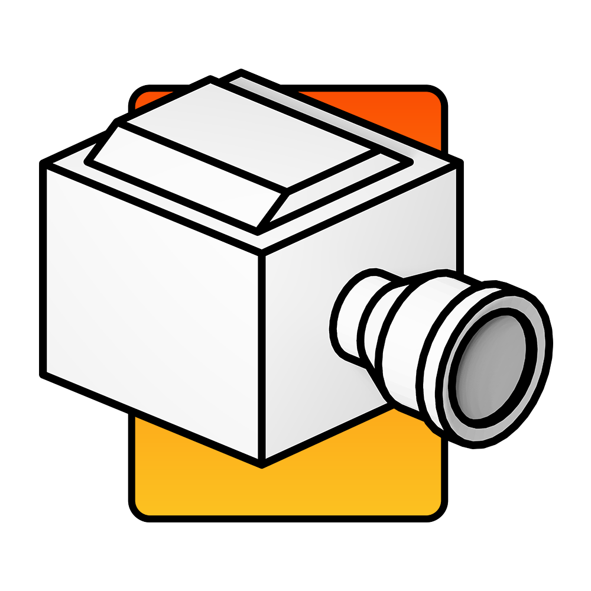
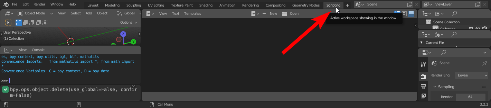
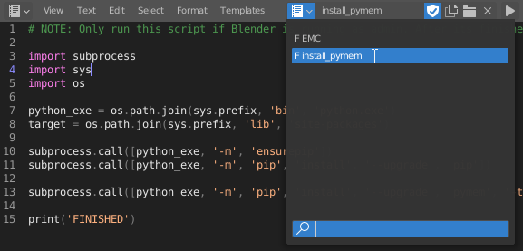
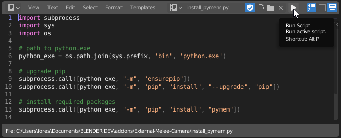
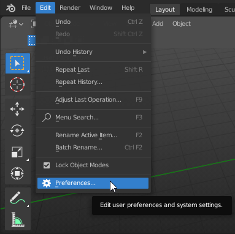
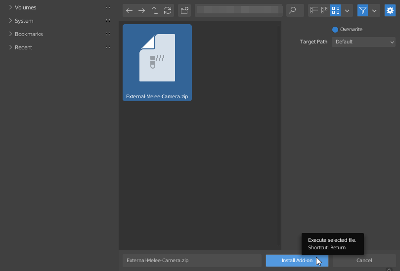
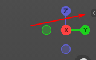
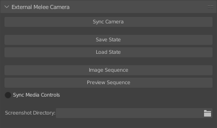

 

  

<h1 align="center">External Melee Camera</h1>

## Description

**EMC** is a Blender add-on that enables you to control various functions in Super Smash Bros. Melee and Dolphin directly from Blender. 

It mainly focuses on camera controls, but it also allows you to load states, toggle play/pause, and generate image sequences.

Consider supporting me on Ko-fi, this project took a lot of time and effort and I would appreciate the tips!

## Getting Started

>### Requirements
>* [Pymem](https://pymem.readthedocs.io/en/latest/)
>* [Blender 2.9.3 LTS](https://www.blender.org/download/lts/2-93/) - Later versions have breaking Python changes.
>* [Slippi Launcher 2.7+](https://slippi.gg/)

## Installing the Add-on
>### Pymem
>To install **Pymem**, run Blender as **administrator** and navigate to the scripting menu.
>
>
>
>Click open, and locate [_install_pymem.py_](https://github.com/sadkellz/External-Melee-Camera/blob/main/resources/install_pymem.py)
>
>
>
>Once opened, run the script.
>
>
###
>### External Melee Camera
>Navigate to your Blender preferences by going to _'Edit > Preferences'_
>
>
>
>Head to the _'Add-ons'_ tab and click _'Install...'_
>
>
>
>Locate _External-Melee-Camera.zip_ and click _Install Add-on_
> 
>

## Scene Setup
> ### Blender File
> To get started, open the provided [emc_stages.blend](https://github.com/sadkellz/External-Melee-Camera/blob/main/resources/emc_stages.blend) file. This Blender scene contains all of the legal stages
> in their own collections, to be used as reference when creating a camera animation.
> 
> The control panel is located in the 3D View sidebar.  
> 
> #### _NOTE: Dolphin must be running for the panel to appear!_
> 
> 
> ### Descriptions
> > ##### Sync Camera
> > This feature allows you to control the camera in Super Smash Bros. Melee using Blender. Press _'Q'_ to disable camera control.
> 
> > ##### Save State
> > This creates a Dolphin save state. Will overwrite the oldest state.
> 
> > ##### Load State
> > Loads the last saved state.
> 
> > ##### Image Sequence
> > Loads the last state saved, and starts saving screenshots in Dolphin for the duration of Blenders frame range.
> > These images can be found at  
> > `C:\Users\*your name*\AppData\Roaming\Slippi Launcher\playback\User\ScreenShots`  
> > **_Note: Screenshot Directory must be set for this feature to work properly._**
> 
> > ##### Preview Sequence
> > Will preview a sequence by loading the last state saved, and step through the frame range of Blender.
>
> > ##### Sync Media Controls
> > This function will toggle the play/pause state of Melee in sync with Blender's play/pause state.
> 
> > ##### Screenshot Directory
> > This is where you set the directory of where Dolphin saves screenshots to.  
> > `C:\Users\*your name*\AppData\Roaming\Slippi Launcher\playback\User\ScreenShots`

## Contact
Any questions or trouble? Get in touch.  

[**Twitter**](https://twitter.com/sadkellz)  
**Discord:** KELLZ#0001
## License

This project is licensed under the GPL 3.0 License - see the [LICENSE.md](https://github.com/sadkellz/External-Melee-Camera/blob/main/LICENSE.md) file for details

## Acknowledgments
[Slippi](https://slippi.gg/)  
- Without Slippi and its replay capabilities, this add-on wouldn't be nearly as powerful.  

[Dolphin Freelook Manipulator For Blender 2.8](https://github.com/John10v10/-Useless-DolphinToolForBlender)
- The project that made me realize this was even possible.  

Thanks to [Whisk](https://github.com/jamesprayner), Solanum, Mike, and Josh for helping me a long the way.