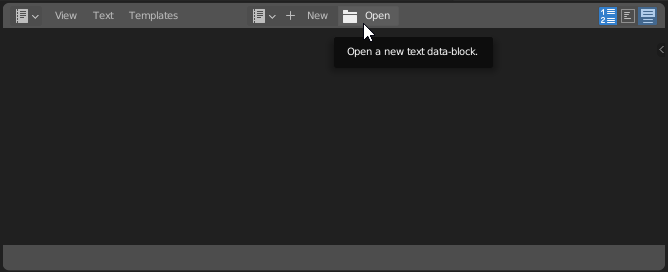
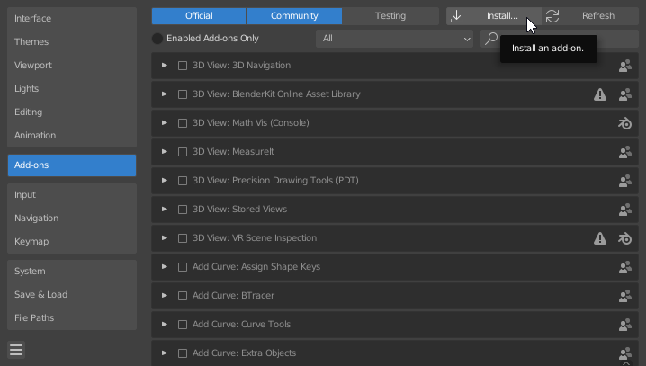

 

  

<h1 align="center">External Melee Camera</h1>

## Description

**EMC** is a Blender add-on that integrates the ability to control various Melee and Dolphin functions from within Blender.

This tool primarily focuses on camera functions, but is able to load states, play/pause, and create image sequences as well.
## Getting Started

### Requirements

* [Pymem](https://pymem.readthedocs.io/en/latest/)
* [Blender 3.1+](https://www.blender.org/download/) - Not tested on earlier versions.
* [Slippi](https://slippi.gg/)

### Installing the Add-on
#### Pymem
To install **Pymem**, open Blender and navigate to the scripting menu.

Click open, and locate [_install_pymem.py_]()

Once opened, run the script.

###
#### External Melee Camera
Navigate to your Blender preferences by going to _'Edit > Preferences'_

Head to the _'Add-ons'_ tab and click _'Install...'_

Locate _External-Melee-Camera.zip_ and click _Install Add-on_

#### 

### Using the panel

## Authors
[KELLZ](https://twitter.com/sadkellz)

## License

This project is licensed under the GPL 3.0 License - see the LICENSE.md file for details

## Acknowledgments
